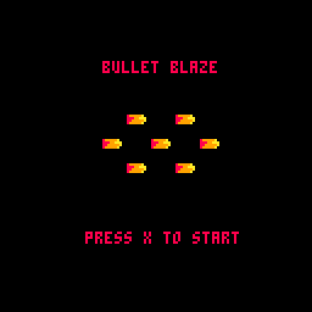
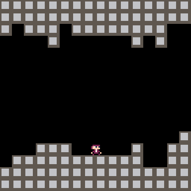

# BulletBlaze
Video Game development utilizing PICO-8.

## How to play
You can play the functional prototype by utilizing the web application of the game found in below, just click the link and play!. Another way tp play is download and load the Pico-8 cart directly which is found in the functional prototype folder named "BulletBlaze.p8".

[Bullet Blaze Web Demo](/Functional_Prototype/bulletblaze.html)

